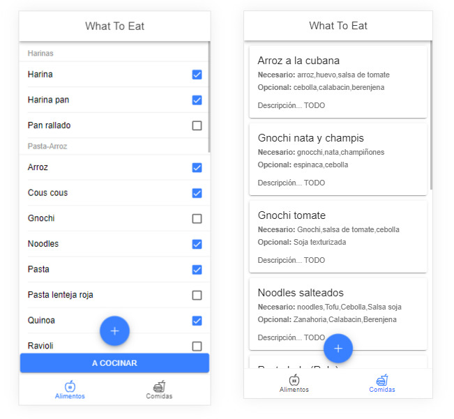

# WhatToEat



---

### Description

A simple application for personal use to solve one of the most recurrent discussion in my home, the what do we eat tonight? momment. The app allows you to save and choose your available ingredients, and based on that, it tells you what recipes you can make with them. The application is built on ionic for the front end, firebase for the database and capacitor for installation on the phone.

---

## Use

To run the project you will need a firebase account with a database having two collections, one called food and one called meal. 

Clone the repository, configure your firebase into the environments variables.

Run:

 ```npm install``` to install the needed packages.
 
 ```ng serve -o``` to run the application


---

## Technologies

- Ionic
- Capacitor
- Firebase

---

## Author Info

- Linkedin - [Federico Andrés Jácome Castañeda](https://www.linkedin.com/in/federicojacome/)
- Website - [Portfolio](http://fedeandresdeveloper.online/)

[Back To The Top](#MTBMalaga)
